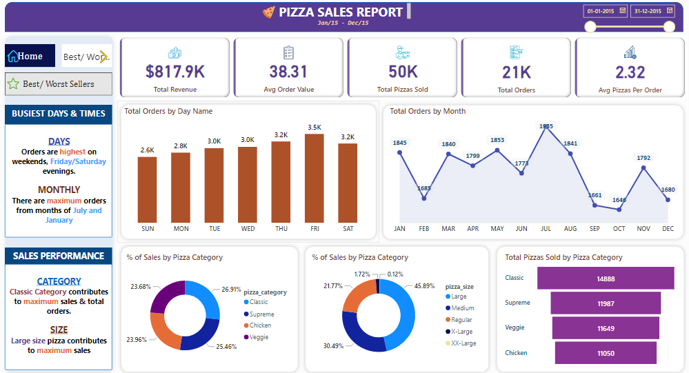

# Pizza Sales Analysis Power BI Project

## **Project Overview**

This Power BI project aims to analyze pizza sales data to gain insights into key performance metrics and trends. SQL was used to derive metrics and answer business questions about revenue, order trends, and product popularity. The resulting Power BI dashboard provides a visual representation of the data, enabling easy analysis and decision-making.

---

## **Screenshots**

Below are screenshots of the key visualizations and insights presented in the dashboard:

- **Home**  
  

- **Best Sellers And Worst Sellers Pizzas**  
  

---

## **Key Metrics**

The analysis includes the following metrics to evaluate performance:

- **Total Revenue**: Total price of all pizza orders.
- **Average Order Value (AOV)**: Average spend per order, calculated as Total Revenue / Total Orders.
- **Total Pizzas Sold**: Total quantity of pizzas sold.
- **Total Orders**: Total number of orders placed.
- **Average Pizzas per Order**: Average number of pizzas per order, calculated as Total Pizzas Sold / Total Orders.

---

## **Visualizations**

**To provide meaningful insights into pizza sales, the following visualizations were created:**

1. **Hourly Trend for Total Pizzas Sold**: A stacked bar chart shows hourly trends for total pizzas sold over a specific time period, highlighting order volume patterns.

2. **Weekly Trend for Total Orders**: A line chart illustrating weekly total orders throughout the year, allowing identification of peak weeks or high-activity periods.

3. **Percentage of Sales by Pizza Category**: A pie chart visualizes the sales distribution across different pizza categories, revealing category popularity and contribution to overall sales.

4. **Percentage of Sales by Pizza Size**: A pie chart displaying the percentage of sales by pizza size, providing insights into customer preferences for different pizza sizes.

5. **Total Pizzas Sold by Pizza Category**: A funnel chart presenting total pizzas sold per pizza category, enabling comparison of sales across categories.

6. **Top 5 Best Sellers by Revenue, Total Quantity, and Total Orders**: A bar chart highlights the top 5 best-selling pizzas based on revenue, quantity, and orders, identifying popular options.

7. **Bottom 5 Best Sellers by Revenue, Total Quantity, and Total Orders**: A bar chart showcases the bottom 5 worst-selling pizzas based on revenue, quantity, and orders, identifying underperforming items.

---

## **Tools and Technologies Used**

1. **Power BI**: For data visualization and dashboard creation.
2. **SQL**: For data processing, calculations, and answering business questions.

---

## **Insights and Recommendations**

This dashboard offers insights into customer preferences, sales trends by time and category, and the performance of different pizza options. Identifying top and bottom sellers allows for data-driven decisions to improve menu offerings and sales strategies.
